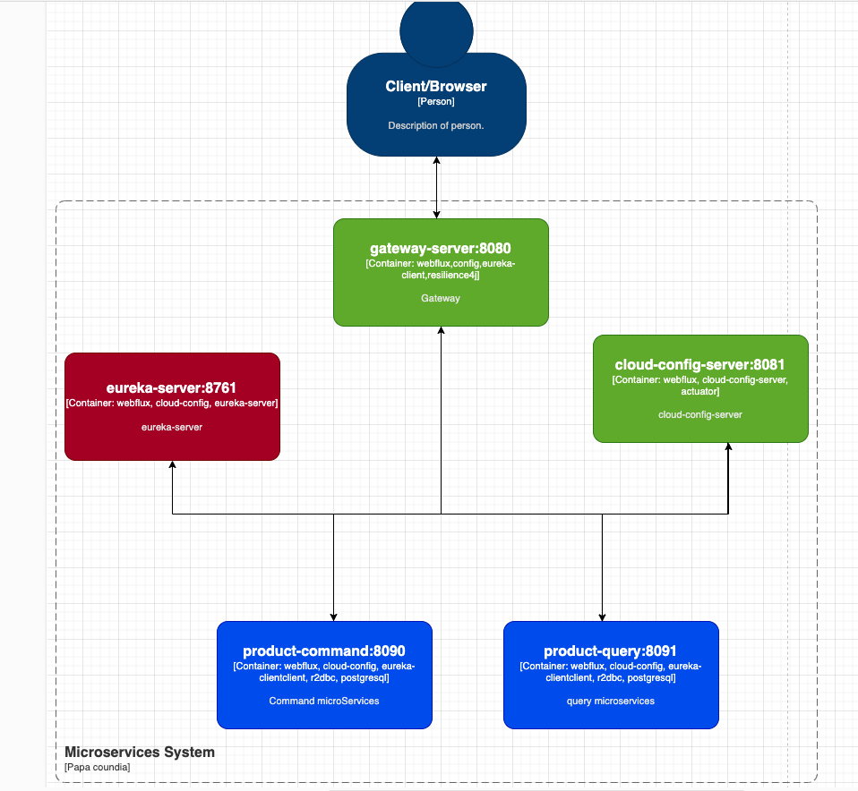

# Starter Microservices Spring Cloud

Dans cet article, je vous présente mon projet de starter microservices basé sur l’écosystème **Spring Cloud**, incluant **Eureka**, **Cloud Config**, **Gateway**, **Axon**, **RabbitMQ**, et **PostgreSQL**. L’objectif est de fournir un exemple de configuration et d’implémentation entièrement réactive et scalable.
Dans un environnement 100% réactif avec **WebFlux** et **R2DBC**(Non bloquant), les microservices communiquent entre eux de manière asynchrone,
ce qui permet de gérer un grand nombre de requêtes simultanées.

Le project est modulaire et évolutif disponible dans ici :
[https://github.com/coundia/spring-microservices-starter](https://github.com/coundia/spring-microservices-starter)

## Sommaire
1. [Architecture Globale](#architecture-globale)
2. [Services Principaux](#services-principaux)
3. [Configuration Eureka](#configuration-eureka)
4. [Configuration du Cloud Config Server](#configuration-du-cloud-config-server)
5. [Configuration du Gateway](#configuration-du-gateway)
6. [Axon, RabbitMQ, et PostgreSQL](#axon-rabbitmq-et-postgresql)
7. [Sécuriser les Microservices](#securiser-les-microservices)
8. [Conclusion](#conclusion)

---

## Architecture Globale

Voici un aperçu de la structure du projet :



- **Cloud Config Server (Port 8081)** : Serveur de configuration centralisé.
- **Eureka (Port 8761)** : Service de découverte pour enregistrer et localiser les microservices.
- **Gateway (Port 8080)** : Point d’entrée unique, qui fait du load-balancing et du routage.
- **Product-Command (Port 8090)** : Microservice pour gérer les commandes (CUD) des produits.
- **Product-Query (Port 8091)** : Microservice pour gérer la consultation (Read) des produits.

L’ensemble est orchestré par Docker ou Docker Compose pour une gestion simplifiée de l’infrastructure.
## Architecture DDD

Le projet est basé sur l'architecture **DDD** (Domain Driven Design) avec les couches suivantes :


source: https://www.hibit.dev/posts/15/domain-driven-design-layers

- **Domain Layer** : Contient les entités, les valeurs d’objet, les agrégats, les événements, les commandes, les gestionnaires de commandes, les spécifications, les services de domaine, etc.
- **Application Layer** : Contient les services d’application, les gestionnaires de commandes, les gestionnaires de requêtes, les gestionnaires d’événements, etc.
- **Infrastructure Layer** : Contient les implémentations des interfaces de persistance, les implémentations des interfaces de messagerie, les implémentations des interfaces de configuration, etc.
- **Presentation Layer** : Contient les contrôleurs REST (@RestController)

## Services Principaux

### Cloud Config Server
Ce service charge la configuration depuis un dépôt Git local ou distant. L’application consomme ensuite cette configuration au démarrage pour centraliser et uniformiser la configuration.

### Eureka
Chaque service s’enregistre auprès de **Eureka** et peut ensuite découvrir les autres services par leur nom logique, sans avoir à connaître les adresses réseau exactes.

### Gateway
Permet de centraliser toutes les requêtes sortantes et entrantes. 
Les clients externes n’ont accès qu’au Gateway, qui fait office de passerelle.
Il gère également la résilience avec **Resilience4j** 

### Product-Command
C’est le microservice pour les opérations d’écriture (Create, Update, Delete) sur les produits. Il peut utiliser **Axon** et **RabbitMQ** pour émettre des événements.

### Product-Query
Ce microservice expose des requêtes en lecture pour récupérer la liste ou le détail des produits.

## Configuration Eureka

Voici un extrait typique du `application.properties` pour Eureka :

```properties
spring.application.name=eureka
server.port=8761

# Désactive la découverte pour lui-même
eureka.client.register-with-eureka=false

# eureka.client.fetch-registry=false car c’est le serveur
management.endpoints.web.exposure.include=health,info
```

Une fois démarré, Eureka sera accessible sur `http://localhost:8761/`.

## Configuration du Cloud Config Server

Exemple de configuration minimale :

```properties
spring.application.name=cloud-config-server
server.port=8081
spring.cloud.config.server.git.uri=/MON-PATH/config-repo
```

Dans le dépôt local `config-repo/`, on placera les fichiers `gateway-server.properties`, `product-command.properties`, etc., pour centraliser la configuration.

## Configuration du Gateway

Le Gateway utilise les routes pour rediriger les requêtes vers les microservices :

```properties
spring.application.name=gateway-server
server.port=8080
eureka.client.serviceUrl.defaultZone=http://192.168.1.23:8761/eureka/

spring.cloud.gateway.discovery.locator.enabled=true
spring.cloud.gateway.discovery.locator.lower-case-service-id=true

spring.cloud.gateway.routes[0].id=product-command-route
spring.cloud.gateway.routes[0].uri=lb://PRODUCT-COMMAND
spring.cloud.gateway.routes[0].predicates[0]=Path=/api/v1/commands/products/**
```

## Axon, RabbitMQ et PostgreSQL

- **Axon** : Framework de mise en œuvre de **CQRS** et **Event Sourcing**.
- **RabbitMQ** : Broker de messages pour la communication asynchrone.
- **PostgreSQL** : Base de données relationnelle pour persister les données (Il sert egalement de event store).

### Exemple de test réactif

```java
@Test
void it_should_create_aggregate_reactively() {
    Mono<String> result = Mono.fromFuture(
        commandGateway.send(new CreateProductCommand("productId", "productName"))
    );
    StepVerifier.create(result)
                .expectNext("productId")
                .verifyComplete();
}
```

## Sécuriser les Microservices

Pour vous assurer que seuls les appels venant du Gateway sont autorisés, vous pouvez ajouter un header spécifique (ex. `X-Gateway-Auth`) via un **Route Filter** ou un **Global Filter** dans Gateway, et vérifier la présence de ce header côté microservices :

```properties
spring.cloud.gateway.routes[0].filters[0]=AddRequestHeader=X-Gateway-Auth,true
```

Ensuite, dans chaque microservice :

```java
.http.authorizeExchange(exchanges -> exchanges
        .pathMatchers("/api/v1/commands/**").access(gatewayAuthManager)
        .anyExchange().permitAll()
)
```

## Conclusion

Ce starter fournit une architecture solide basée sur **Spring Cloud**, **Axon**, **RabbitMQ**, et **PostgreSQL**. 
L’objectif est de montrer comment mettre en place une infrastructure microservices réactive, scalable et maintenable. Vous pouvez cloner ce projet, personnaliser la configuration, et ajouter vos propres fonctionnalités pour répondre à vos besoins métiers.

