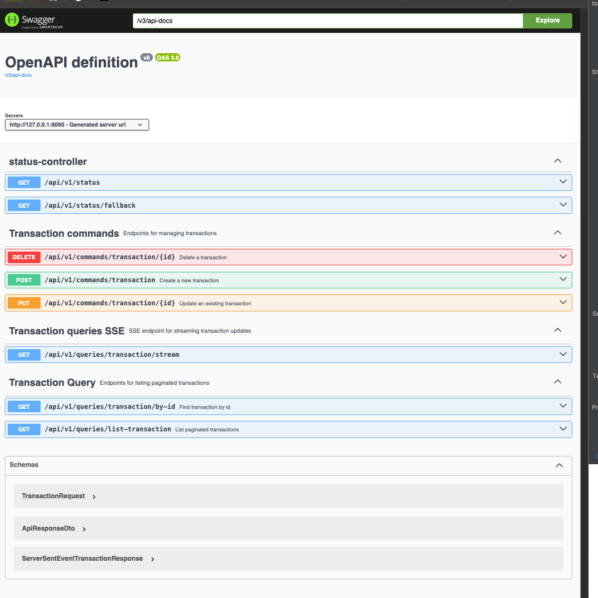

## 🚀 Introduction

La structuration d’une architecture backend propre, modulaire et réactive peut rapidement devenir répétitive et chronophage.
Le **Spring WebFlux Code Generator** répond à ce défi en proposant un outil de génération automatique de code basé 
sur **Spring Boot**,
**Spring WebFlux**, **R2DBC** et les principes **DDD** et **CQRS**. 
Contrairement à d'autres solutions,
il ne dépend pas d'Axon et offre une totale liberté d'implémentation.

## 🎯 Objectif

Automatiser la création de code backend structuré en quatre couches bien définies :

- **Domain** : Modèles, événements, objets de valeur
- **Application** : Use cases, commandes, requêtes, DTO
- **Infrastructure** : Entités, mapping, repository R2DBC, configuration
- **Presentation** : Contrôleurs REST et SSE

Le tout, en exploitant les atouts suivants :

- Spring WebFlux pour un traitement non-bloquant
- R2DBC pour la persistance réactive
- SSE (Server Sent Events) pour le streaming temps réel
- Mustache comme moteur de templates pour générer le code

## 💠 Stack Technique

- Spring Boot 3+
- Spring WebFlux
- Spring R2DBC
- PostgreSQL
- Mustache (template engine)
- Swagger/OpenAPI
- Java 17+

## 📦 Architecture Générée


source: [https://www.hibit.dev/posts/15/domain-driven-design-layers](https://www.hibit.dev/posts/15/domain-driven-design-layers)

```text
project-root/
├── domain/
│   └── model, events, valueObjects
├── application/
│   └── usecases, commands, queries, handlers, dto
├── infrastructure/
│   └── repository, entity, config
├── presentation/
│   └── controller (REST, SSE)
```

## ⚙️ Utilisation

Pour générer une entité complète :

```bash
POST http://127.0.0.1:8070/api/v1/generator/all
Accept: application/x-ndjson
Content-Type: application/json

{
    "outputDir": "/Users/pcoundia/projects/cqrs-rabbitmq-webflux-starter/src/main/java/com/pcoundia/transactions",
    "definition": {
      "name": "Transaction",
      "table": "transactions",
      "fields": [
        { "name": "id", "type": "String" },
        { "name": "reference", "type": "String" },
        { "name": "amount", "type": "Double" }
      ]
    }
}
```

## 📱 Domaines d'application

- Systèmes temps réel (finance, IoT, messagerie)
- Backends orientés microservices
- Dashboards de monitoring
- Applications SaaS back-office

👉 Voir le projet généré : [GitHub - cqrs-webflux-starter](https://github.com/coundia/cqrs-webflux-starter)

# Documentation générée



- 🧩 Client SSE Angular : [angular-client-sse](https://github.com/coundia/angular-client-sse)
 

Ce projet démontre la puissance de l’automatisation dans les architectures modernes.
Il constitue une excellente base pour tout projet ambitieux nécessitant une gestion claire et efficace de la logique métier.

Ce projet est en constante évolution, restez connecté sur github. 

